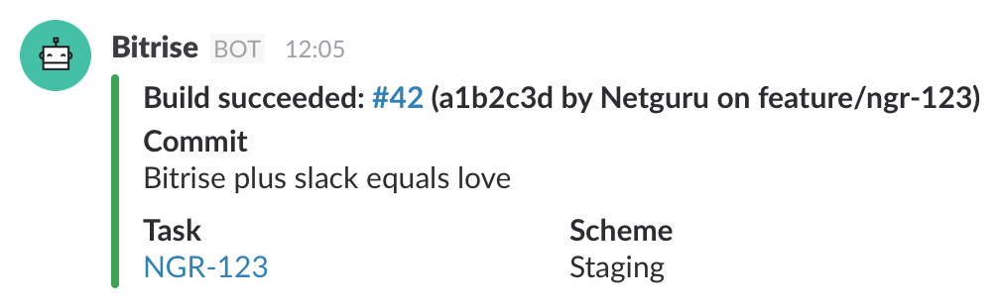

# bitrise-step-slack

A next-gen Slack webhook step for Bitrise.



## Features

- **All commit information included:** Messages include commit hash, author, branch and, of course, message.
- **Attachment-powered:** Take advantage of rich message attachments formatted according to build status.
- **JIRA task extraction:** The step scans your branch name for JIRA task ID and includes it in the message.
- **Xcode scheme extraction:** Messages include information about Xcode scheme used to build your project.

### Upcoming features

- [HockeyApp integration](https://github.com/netguru/bitrise-step-slack/issues/4)
- [Custom bot user icon](https://github.com/netguru/bitrise-step-slack/issues/5)
- [Test results and coverage](https://github.com/netguru/bitrise-step-slack/issues/6)

## Usage

### bitrise.yml

To use this step in your Bitrise workflow, prefix the step name with a Git URL of this repository:

```yml
steps:
  - git::git@github.com:netguru/bitrise-step-slack.git@master:
      title: slack
      inputs:
        - webhook_url: https://team.slack.com/...
        - channel: "#general"
```

### bitrise.io

As bitrise.io doesn't allow to add a custom step using the UI Workflow Editor, use the YAML editor to manually add the step to the workflow. Follow the guide above.

### Environment variables

The step supports the following custom environment variables, which may be set in `bitrise.yml` or in Bitrise.io UI editor:

- `JIRA_DOMAIN`: The domain of your JIRA installation (found in the URL, e.g. `https://JIRA_DOMAIN.atlassian.net`)
- `JIRA_PROJECT_KEY`: The key of your JIRA project, used to scan branch names for task IDs.

### Bot user icon

If you want to see a custom bot icon, like on the screenshot above, you need to add a custom `:bitrise:` emoji for your Slack team. You can find the default one in [resources/icon.png](resources/icon.png).

We're planning to add support for custom emoji/URL icons for your bot user as soon as possible.

## Development

### Requirements

This step requires the following pre-installed dependencies:

- [Ruby](https://rvm.io) >= 2.2

### Configuration

The step reads its configuration from environment. Since it uses `dotenv`, you can configure your step by duplicating `.env.default` file into a `.env` file and edit the values in there.

Keep in mind that `.env` file is ignored by Git, so you can put sensitive information (such as webhook URL) in there. It will not be committed.

### Running

Run your step by executing `step.sh` file:

```bash
$ ./step.sh
```

### Dependencies

The dependencies are installed automatically when you run `step.sh`.

### Committing

This repository uses git-flow and protects `develop` and `master` branches from force pushes, which means the whole development process is pull-request-driven.

The standard code review procedures are in place as well (although perhaps it should be done by Ruby developers).

## About

This project is made with <3 by [Netguru](https://netguru.co/opensource).

### License

Licensed under the MIT License. See [LICENSE.MD](LICENSE.MD) for more info.
